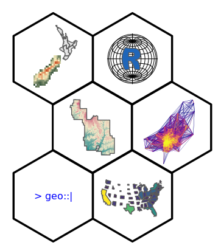
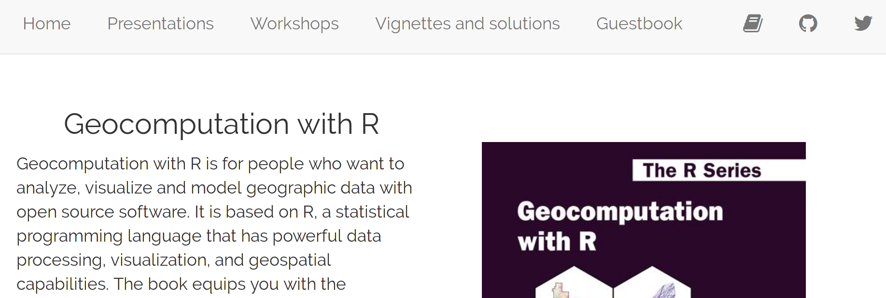

```{r setup, include=FALSE}
options(htmltools.dir.version = FALSE)
knitr::opts_chunk$set(echo = FALSE, fig.align = "center", message = FALSE)
```

# The Geocomputation with R book

.pull-left[
```{r, out.width="75%"}
knitr::include_graphics("figs/cover.png")
```
]

.pull-right[
- Geocomputation with R is for people who want to analyze, visualize and model geographic data with open source software
- Two years in the making
- Three main parts: Foundations, Extensions, and Applications
- The online open source version of the book is hosted at https://geocompr.robinlovelace.net
- This book has now been published by CRC Press in the R Series - you can buy the book from [CRC Press](https://www.crcpress.com/Geocomputation-with-R/Lovelace-Nowosad-Munchow/p/book/9781138304512), [Wordery](https://wordery.com/geocomputation-with-r-robin-lovelace-9781138304512), or [Amazon](https://www.amazon.com/Geocomputation-Chapman-Hall-Robin-Lovelace/dp/1138304514/)
]

<!-- 1. intro to the book -->
<!-- 2. intro to the concepts of open source books: -->
<!-- Over the last few years, a quiet revolution has been brewing in the R book publishing industry. -->
<!-- Since the publication of early open source books, such as Advanced R (published in 2014), many authors have switched to a hybrid system, in which books are published online *and* in print. -->
<!-- This approach has several advantages, including -->
<!-- (1) people can choose how to read the book, online or in print, and make an informed decision before buying it; -->
<!-- (2) the book retains the process of reviews and professional copy-editing provided by publishers; -->
<!-- (3) the wider community can contribute, leading to many improvements in the code and text. -->

---
# The book beginnings

<!-- https://nowosad.github.io/post/geocomputation-with-r-the-afterword/ -->

.pull-left[
During my PhD, I spent a lot of time learning R and applying it to my research. That was also a period when I had an opportunity to teach several courses, and some of them, including Geostatistics, where heavily based on R and its spatial components.

I had met Robin Lovelace in June 2016. He was in Poznan, Poland to give a short course on spatial data analysis in R for undergraduate and graduate students at the Adam Mickiewicz University, while at that time I was just a few weeks before my PhD thesis defense. We spent some time exchanging our own experiences about spatial R and our approaches to teaching it. During this talks, we found that we shared an idea of writing a book. A book explaining how to use R for spatial data analysis, where the main audience is ourselves just a few years before.
]

.pull-right[
photo
]

---
# The publisher

.pull-left[
```{r, out.width="80%"}

```

```{r}

```
]

.pull-right[
<!-- can we think of more pros or cons?-->

**A hybrid system**, in which books are published online *and* in print:

- People can choose how to read the book, online or in print, and make an informed decision before buying it
- The book retains the process of reviews and professional copy-editing provided by publishers<!-- translations -->
- The wider community can contribute, leading to many improvements in the code and text

Of course, you can always [self-publish a book](https://blog.datascienceheroes.com/how-to-self-publish-a-book/)...

<!-- how to start -->
<!-- add some text about creating a proposal to the publisher -->
]

---
# The book infractucture

.pull-left[
**Several developments have enabled this:**

- [**Bookdown**](https://bookdown.org/yihui/bookdown/) - R package built on top of R Markdown; complete solution for creations books in multiple formats (PDF/HTML/Word/…); allows for numbering and cross-referencing figures/tables/sections/equations, etc.
- [**GitHub**](https://github.com/) - stores the book code; allows for collaboration 
- [**Travis CI**](https://travis-ci.org/) - automatically builds the book after code changes
- [**Netlify**](https://www.netlify.com/) - hosts the book website
- [**Zotero**](https://www.zotero.org/) - stores the references
- **Existing R packages** - e.g. [citr](https://github.com/crsh/citr) - eases inserting citations; [kableExtra](https://github.com/haozhu233/kableExtra) - creates tables
- **New R packages** - [geocompkg](https://github.com/geocompr/geocompkg) - allows for install of all packages used in the book; [spData](https://github.com/Nowosad/spData) - contains data used in the book
]

.pull-right[
```{r, out.width="100%"}

```
]

---
# An open source book

.pull-left[
```{r}
knitr::include_graphics("figs/geocompr-github.png")
```
]

.pull-right[
We decided early on to develop this book in the open to remove financial barriers to learning open source software. It also enables community contributions, which we encourage on any part of the book, for example:

- Improvements to the text, e.g. clarifying unclear sentences, fixing typos
- Changes to the code, e.g. to do things in a more efficient way
- Suggestions on content in the issue tracker
]

---
# A collaboration

.pull-left[
- Start with an outline, but don't be afraid to change it later
- Schedule regular time to write - make it a habit
- Have [a book style](https://github.com/Robinlovelace/geocompr/blob/master/our-style.md), e.g. **package**, `function()`, `=`, `en-us` spelling
- Stay in touch with your co-authors - regular contact: [Gitter](https://gitter.im), [Skype](https://www.skype.com/en/)
- Keep a feedback loop going
- Be kind and positive
]

.pull-right[
gif/images with line by line writing
]

---
# The third author

.pull-left[
```{r}
knitr::include_graphics("figs/jannes.jpg")
```

]

.pull-right[
A few months into making the book, Robin and I were contacted by a person we never met before, a postdoc at Friedrich-Schiller-University Jena and an author of the RQGIS package. The ‘first contact’ seems to have been in the RQGIS issue tracker, where Robin and I commented saying that we’d like to mention the package in the book, hoping for feedback. We ended up with much more than that!

Jannes Muenchow, the mysterious figure mentioned above, firstly gave us a concise idea about a chapter showing how to bridge R with traditional geographic information system software and next he wrote a high-quality piece of text and code.
]

---
# An open source cycle I

.pull-left[
**Exisiting R packages**, including:

- [sf](https://github.com/r-spatial/sf)
- [raster](https://github.com/rspatial/raster)
- [tmap](https://github.com/mtennekes/tmap)
- [mapview](https://github.com/r-spatial/mapview)

**Existing software**, including:

- [GDAL](https://gdal.org/)
- [PROJ](https://proj.org/)
]

.pull-right[
photos of packages/software authors
]

---
# An open source cycle II

.pull-left[
**[Our impact](https://github.com/Robinlovelace/geocompr/blob/master/our-impact.csv)**

- Proposing enhancements
- Reporting of bugs
- Clarifying of documentations
- Pull requests

<!--add examples - text-->
]

.pull-right[
<!--add examples - images-->
]

---
# An open source cycle III

.pull-left[
<!--add examples - images-->


]

.pull-right[
**Existing packages authors' feedback**:

- Comments
- Suggestions
- Reviews
- Pull requests

<!--add examples - text-->
<!--e.g. Rogers input on R history; David Cooley on mapview-->
]

---
# An open source cycle IV

.pull-left[

```{r}

```
]

.pull-right[
**Readers input:**

- Comments/suggestions/questions/requests (more than 200 GitHub issues)
- Pull requests  (more than 200 GitHub pull requests)
- Even the book cover image!

<blockquote class="twitter-tweet" data-lang="en"><p lang="en" dir="ltr">We are pleased to announce that the winner of our geocompr book cover competition is Marco Sciaini (<a href="https://twitter.com/msciain?ref_src=twsrc%5Etfw">@msciain</a>). Now we are working with him on a final version of the book cover. Thanks for all your submissions!</p>&mdash; Jakub Nowosad (@jakub_nowosad) <a href="https://twitter.com/jakub_nowosad/status/1034850749669404672?ref_src=twsrc%5Etfw">August 29, 2018</a></blockquote>
<script async src="https://platform.twitter.com/widgets.js" charset="utf-8"></script>
]


---
# Additional materials

- https://geocompr.github.io/

--

```{r}

```

--

**It contains:**

.pull-left[
- Presentations
- Workshops materials
- Guestbook
]

.pull-right[
- Book exercises' solutions
- Extended examples
- Additional articles
]

---
# Community

.pull-left[
```{r}

```


]

.pull-right[

The Geocomputation with R book is still alive:

- [Twitter](https://twitter.com/hashtag/geocompr) - #geocompr, #rspatial
- [GitHub](https://github.com/Robinlovelace/geocompr) - there are still new suggestions/questions/requests and pull requests

<!--what else?-->
]


---
# Closing notes

.pull-left[
<!-- issues are both social and technical-->

**Issues:**

- Having consistent html and pdf versions, especially when using a published LaTeX style<!--it is good to know about that from the start-->
<!-- - show some issues (e.g. having HTML and pdf, too wide code chunks outputs, ...)  -->
- Connecting exercises to the solutions<!--e.g. updates-->
- Relating book code chunks outputs to their code<!--new R session/old R session-->
- Formal reviewing process do not use GitHub issues/pull requests
- Formal copy editing do not use bookdown

<!--what else??-->
]

.pull-right[
**How to start:**

- Visiting https://bookdown.org/
- Xie, Y. (2016). Bookdown: Authoring Books and Technical Documents with R Markdown. Chapman and Hall/CRC. https://bookdown.org/yihui/bookdown/
- Reading source codes of existing books, e.g. https://github.com/Robinlovelace/geocompr, https://github.com/hadley/r4ds
]


---
class: left, top


.pull-left[
## Summary:

<!--what else??-->

- Writing a book is hard, but very satisfying
- Collaboration is crucial
- Most parts of the book creation infrastructure is already here
- Thank you all!


]


.pull-right[
## Contact:

Twitter: `r icon::ii_social_twitter()` #geocompr

Twitter: `r icon::ii_social_twitter()` jakub_nowosad

Twitter: `r icon::ii_social_twitter()` robinlovelace

## Resources:

https://geocompr.github.io/

https://nowosad.github.io

https://www.robinlovelace.net/
]


.footnote[
**Slides:** https://geocompr.github.io/user_19/presentation/
]

